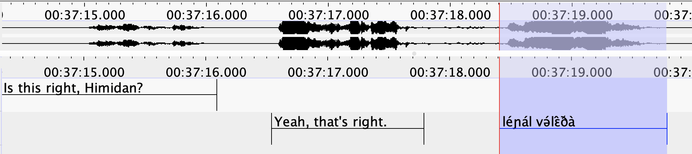
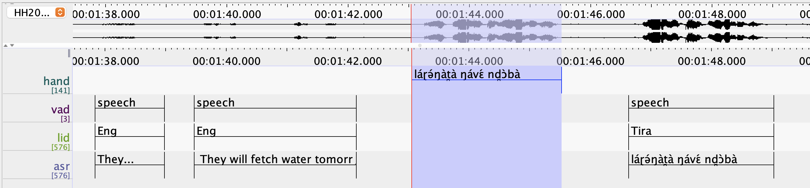
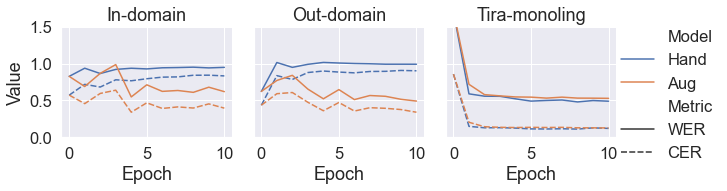
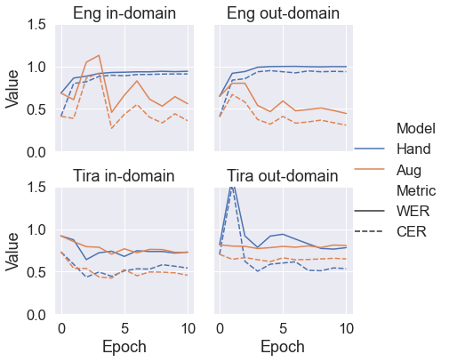

---

## Roadmap
- Background
- Tira language project
- Experiment
- Dataset creation
- Results

---

# Background

---

## Automatic speech recognition
- (aka ASR)
- Technology for transcribing speech automatically
- Used in:
	- Voice assistants (Siri, Alexa, Cortana)
	- Automatic captioning
	- Audio annotation

---

## Language documentation
- "Lasting, multipurpose record of a language"[@himmelmannChapterLanguageDocumentation2008]
- Language documentation can occur in context of linguistic fieldwork (in-situ or ex-situ)
- In this presentation "fieldwork language" = language being documented

---

## ASR for language documentation
- Language documentation produces large quantities of audio data
	- Could ASR speed up annotation?
- Challenging as modern ASR systems trained for high-resource languages
	- English, Spanish, Mandarin, etc.
- Applying ASR to fieldwork languages requires either **training** a new ASR model from scratch or **fine-tuning** an existing ASR model using data from the given fieldwork language

---

## Prior work on ASR for documentation
- Prior research has proposed new model architectures [@adamsEvaluationPhonemicTranscription2018;@jimersonASRDocumentingAcutely2018;@prudhommeauxAutomaticSpeechRecognition2021;@amithEndtoEndAutomaticSpeech2021]
- And investigated fine-tuning models for fieldwork languages [@morrisOneSizeDoes2021;@jimersonUnhelpfulGuideSelecting2023]
- However, these works focus on one particular genre of data: **monolingual narratives**
- What can we do with fieldwork data that isn't monolingual?

---

## Linguistic elicitation
- **Elicitation** is a common method for gathering data on a language
- Consists of "asking questions" [@moselChapterFieldworkCommunity2008] from language speakers
	- E.g. translations of target words or sentences
	- grammaticality or felicity judgments
	- possible conversational responses
- Elicitation is often bilingual with a **meta language** used to prompt and study the fieldwork language

---

## ASR for bilingual elicitation
- Likely received less attention in fieldwork ASR literature due to:
	- Difficulty of training ASR on bilingual vs monolingual audio
	- Fieldwork teams not likely to create annotations for the metalanguage that can be used for training
- Can we use ASR to help annotate this genre of data?

---

## Whisper
- Multilingual ASR model from OpenAI [@radfordRobustSpeechRecognition2022]
	- Current state of the art in ASR for high-resource languages like English
- Can specify language audio is in or let Whisper guess
	- 99 languages supported
- ASR, voice activity detection (identifying speech vs no speech) and language identification all handled under one roof
	- No pipelines needed!
	- $\Rightarrow$ good candidate for ASR on bilingual elicitation

---

## Whisper on code-switched data
- Whisper not designed to transcribe code-switched audio
	- Given multilinguality, Whisper has some capacity to generalize to code-switching nevertheless [@pengPromptingHiddenTalent2023]
- Bilingual elicitation is a similar use case to code-switched audio
	- Can we adapt Whisper to bilingual elicitation?

---

# Tira language project

---

## Tira language project
- Tira is a Kordofanian language of the Heiban group spoken in Nuba mountains region in Sudan
- Tira language project studied Tira with consultant Himidan Hassen from 2020 to 2024
	- Remote elicitation over zoom
	- Himidan recorded sessions on his computer with a microphone using Audacity
	- Topics covered lexicon, inflectional and derivational morphology, tonal phonology, syntax
	- English used as metalanguage for elicitation

---

## Tira data annotations
- Team hand-transcribed Tira elicited Tira sentences from elicitation audio
	- Time-aligned annotations created using ELAN [@sloetjesAnnotationCategoryELAN2008]
	- Narrow phonetic transcription of Tira using IPA

- Transcribed Tira sentences can be used for training ASR on Tira
	- Hopefully, Whisper should retain knowledge of transcribing English as it learns Tira, and then be able to adapt to bilingual Tira-English audio

---

## Tira data annotations (cont.)
- English portions of recording not transcribed by hand
- Can we use English audio for training anyways?
	- Since Whisper is SOTA for English, we could use Whisper itself to annotate English portions of elicitation audio and train on that
	- This process is known as **data augmentation**

---

# Experiment

---

## Experimental questions
1. When fine-tuned on Tira, how well does Whisper generalize to bilingual elicitation in Tira and English?
2. Does adding automatically transcribed English when training enable better generalization to bilingual elicitation?

---

## Experimental process
- Organize elicitation data into ASR dataset
- Hand-annotate recordings for evaluation
- Generate machine labels for English data
- Train two models:
	- "Hand" model trained only on hand-labeled Tira datasets
	- "Augmented model" trained on both Tira and (augmented) English data

---

# Dataset creation

---

## Tira ASR dataset
- Trained on 9.5 hours of Tira
	- 42 hours of automatically transcribed English added during data augmentation
- Tested models on three datasets
	- Monolingual Tira (1h)
	- Bilingual English+Tira (1h)
		- Two recordings: in-domain and out-domain
			- In-domain = Tira was seen by model during training, English was not
				- Skipped adding English from in-domain recording for augmented training data
			- Out-domain = neither Tira nor English was seen during training

---

## English data augmentation

- Use PyAnnote voice activity detection [@bredinPyannoteMetricsToolkit2017] to identify unannotated regions of speech 
- Use language identification (LID) to label regions as Tira or English
	- Use Whisper large-v2 to transcribe English
	- Use Whisper model fine-tuned on Tira to transcribe Tira
		- This was a very small portion of data (~0.2% of the final training set)
- Join hand-labeled Tira utterances with neighboring automatically labeled utterances

---

## Limitations of the augmentation pipeline
- VAD + LID pipeline very 'coarse' and often lumps Tira & English sentences together
- LID errors introduce mistranscribed Tira into dataset
	- E.g. *kukungapitito* for {\ipa \[Kúkù ŋgápìt̪ìt̪ɔ́\]} 'Kuku hunted (in someone's place)'
	- Or *ngiyol* for {\ipa \[ŋìjɔ́l\]} 'eat'
- Common Whisper failure modes:
	- Repeated phrases are sometimes only transcribed once
	- Or single word/phrase may repeat over and over again whether it's repeated in the audio or not
	- Entire phrases or sentences may be hallucinated

---

## Data augmentation examples
- Ground truth: "Oh, I introduce Kuku to his mom? You can say it like this: {\ipa jɜ̂ŋcí kúkùŋú lɛ́ŋgɛ̀n}, wait {\ipa jɜ̂ŋcí kúkùŋú lɛ́ŋgɛ̀n} yeah you can say \[$_\mathrm{handlabeled}$ {\ipa jɜ̂ŋcí kúkùŋú lɛ́ŋgɛ̀n}\]"
- Automatic: "Oh, I introduce **Cucutis** mom. **I** can say **I enjoy** this. **Young Chi Kukum Lengen**. **with**. \[$_\mathrm{handlabeled}$ {\ipa *jɜ̂ŋcí kúkùŋú lɛ́ŋgɛ̀n*}]"
	- First repetition of Tira sentence anglicized
	- Second repetition omitted

---

## Data augmentation examples cont.
- Ground truth: \[$_\mathrm{handlabeled}$ "{\ipa íŋgánɔ́nà jôɾà nd̪ɔ̀bà}"\] "Right, in (3) we have..."
- Automatic: \[$_\mathrm{handlabeled}$ {\ipa íŋgánɔ́nà jôɾà nd̪ɔ̀bà}\] **What is the dream we have?** \[$_\mathrm{hallucinated}$ KELOLAND news. If you have a story you'd like to share with us, we're here to help. We're here to help. We're here to help.\]
- Most of transcription is hallucinated!

---

# Experiment

---

## Training
- Fine-tune Whisper large-v3 for 10 epochs on both datasets
	- 1 epoch = 1 iteration through all train data
	- "Hand" – fine-tune on hand-labeled Tira only
	- "Augmented" – fine-tune on Tira + machine-labeled English
- Report word error rate (WER) and character error rater (CER)
	- WER = how many words are predicted incorrectly
	- CER = how many characters are predicted incorrectly
	 - For both, **lower means better**

---

## Training results

- Epoch=0 is equivalent to baseline, i.e. Whisper large-v3 before fine-tuning
- Both models perform almost **exactly the same** on monolingual Tira validation set
- Augmented model best on both bilingual datasets
	- For in-domain, hand model **barely surpasses baseline**
	- For out-domain, hand model **is always worse than baseline**

---

## Output examples: in-domain
- GT = ground truth, HM = hand model, AM = augmented model
- GT: "Is this right, Himidan?" "Yeah, that's right. {\ipa léɲál və́lɛ̂ðà} So the 'éɲá' part is indicating the subject. \[The 'l', this thing at the beginning, is your object.\] Exactly, exactly. That's right."
- HM: "is this right **gimi dan** yeah that's right {\ipa l**i**ɲál və́lɛ̀ðà} so the eɲà part is indicating the subject exactly exactly that's right"
	- Bracketed portion omitted
- AM: "Is this right, **Hibby Dunn**? Yeah, that's right. {\ipa l**ì**ɲál və́lɛ̂ðà} So the **enya** part is indicating the subject. Exactly. Exactly. That's right."
	- Bracketed portion omitted again
	- "{\ipa éɲá}" is anglicized

---

## Output examples: in-domain (cont.)
- GT: "So what are we hearing tone-wise at the beginning? The same as the other one? The same as the other imperfective? I think so. Could you say it again, Himidan? {\ipa láŋə́l və́lɛ̂ðà nd̪ɔ̀bà láŋə́l və́lɛ̂ðà nd̪ɔ̀bà} Okay. {\ipa láŋə́l və́lɛ̂ðà nd̪ɔ̀bà}"
- HM: "{\ipa láŋə́l və́lɛ̀ðà ndɔ̀bà láŋə̄l və́lɛ̀ðà ndɔ̀bà}"
	- English skipped over!
- AM: "So what do we hear tone-wise at the beginning? The same as the other one, the same as the other imperfective. **Thanks, sir.** Did you say **they didn't have them**? {\ipa láŋə́l və́lɛ̂ðà nd̪ɔ̀bà láŋə́l və́lɛ̂ðà nd̪ɔ̀bà} Okay. {\ipa láŋə́l və́lɛ̂ðà nd̪ɔ̀bà}"
	- Only minor errors

---

## Output examples: augmented model (out-domain)
- GT: "So how would you spell this, the word for brown squirrel, Himidan? ŋìcɔ́lɔ̀ should be N-G-I-C-O-L-O. {\ipa ŋìcɔ́lɔ̀. ŋ̀cɔ́lɔ̀} Yeah, ŋìcɔ́lɔ̀. Oh, okay. I heard a different second vowel. Yeah, it's ŋìcɔ́lɔ̀. Would you say it one more time? {\ipa ŋ̀cɔ́lɔ̀ ŋ̀cɔ́lɔ̀}"
- HM: "{\ipa ŋìcɔ́lɔ̀ ŋìcɔ́lɔ̀ ŋìcɔ́lɔ̀ ŋìcɔ́lɔ̀ ŋìcɔ́lɔ̀ ŋìcɔ́lɔ̀ ŋìcɔ́lɔ̀ ŋìcɔ́lɔ̀ ŋìcɔ́lɔ̀ ŋìcɔ́lɔ̀}"
	- Just repeats Tira word

---

## Output examples: augmented model (out-domain)
 - AM: "So how would you spell this? The word for brown squirrel, **Hennie Dunn?** **ngihtolo** should be n-g-i-c-o-lo. **Ngicholo**. {\ipa **ŋìcɔ́lɔ̀**} I heard a different second. It's **me channel**. Would you say it one more time? **neato**"
	- Tira word transcribed correctly once, various incorrect anglicizations elsewhere
	- Remember from data augmentation pipeline that anglicized Tira is present in augmented training data alongside IPA

---

## Conclusion
- Fine-tuning Whisper on Tira resulted in rapid **overfitting** on Tira and **catastrophic forgetting** of English
- Adding in automatically transcribed English to the training data prevented overfitting but introduced errors owing to **anglicized Tira** appearing in the training data
	- This noise in the training data owes to the coarse nature of the VAD+LID pipeline used for data augmentation
	- However, model performance on **monolingual Tira** was not hurt by adding in augmented data
- We discuss genre of bilingual elicitation, but our results are relevant to conversational code-switching as well

---

## Next directions
- Develop more informative evaluation metrics
	- E.g. Tira hit rate
	- LID accuracy per word
- How to clean up augmented data?
	- Iterative training?
	- Re-transcribe non-English looking words?
- Would another ASR architecture (e.g. CTC) hallucinate less?

# Thank you!

---

# Appendices

---

## Metrics by language

---

## Metric table

| Dataset           | Model     | WER      | CER      | Epoch |
| ----------------- | --------- | -------- | -------- | ----- |
| Tira monoling     | Tira only | **0.48** | **0.11** | 8     |
|                   | Augmented | 0.53     | 0.13     | 10    |
| In-domain biling  | Tira only | 0.83     | 0.57     | 2     |
|                   | Augmented | **0.55** | **0.34** | 4     |
| Out-domain biling | Tira only | 0.57     | 0.83     | 0     |
|                   | Augmented | **0.49** | **0.34** | 10    |
